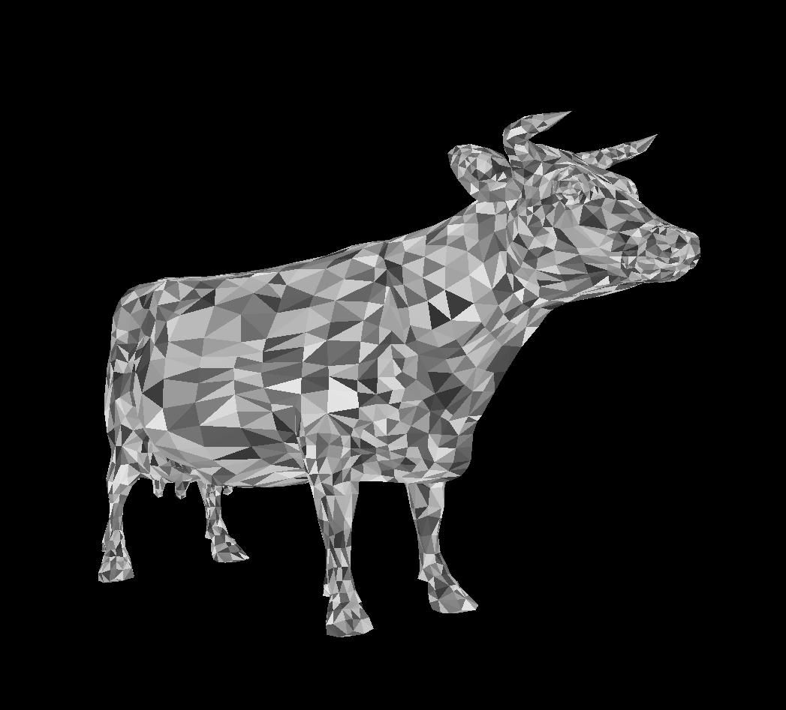
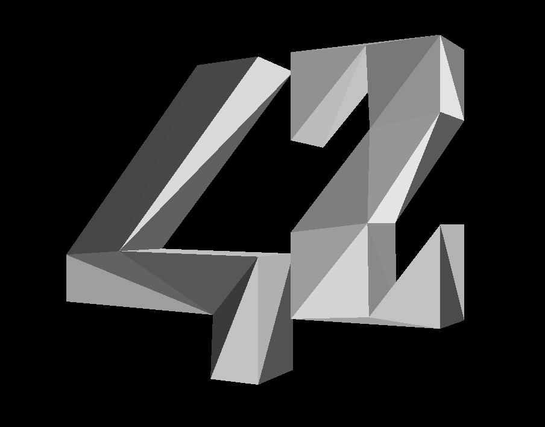

# scop
**An introduction to opengl**

Scop is a C and openGL project using glfw for Key Hooks and window opening.
The executable parse .obj files and display them with different colors and textures.

**A few exemples**

